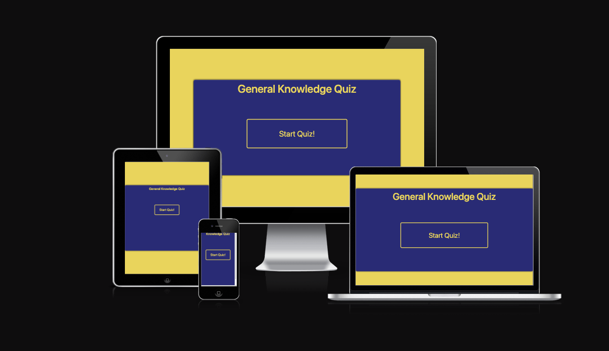

<h1 align="center">General Knowledge Quiz</h1>

[View the live project here.](https://ignasvilkas.github.io/code-project-2-quiz/)

This a a quiz page made for Code Institute Milestone Project 2. It is designed to be responsibe and accessible on a range of devices, making it easy to navigate for potential students and partners.

<h2 align="center"></h2>

## User Experience (UX)

-   ### User stories

    -   #### First Time Visitor Goals

        1. As a First Time Visitor, I want to easily understand the main purpose of the site.
        2. As a First Time Visitor, I want to be able to do the quiz.
        3. As a First Time Visitor, I want to be able to see my result at the end.

    -   #### Returning Visitor Goals

        1. As a Returning Visitor, I want to be able to retake the quiz.
        2. As a Returning Visitor, I want to see if I can improve my score.

-   ### Design
    -   #### Color Scheme
        -   The two main colours used are Navy Blue and Gold.
    -   #### Typography
        -   The Open Sans font is the main font used throughout the whole website with Sans Serif as the fallback font in case for any reason the font isn't being imported into the site correctly. 
    -   #### Imagery
        -   There is no imagery used on this site.

*   ### Wireframes

    -   Monitor Wireframe - [View](assets/img/Monitor%20Wireframe.png)

    -   Tablet Wireframe - [View](assets/img/Tablet%20Wireframe.png)

    -   Mobile Wireframe - [View](assets/img/Mobile%20Wireframe.png)

## Features

-   Responsive on all device sizes

-   Interactive elements

## Technologies Used

### Languages Used

-   [HTML5](https://en.wikipedia.org/wiki/HTML5)
-   [CSS3](https://en.wikipedia.org/wiki/Cascading_Style_Sheets)
-   [JavaScript](https://en.wikipedia.org/wiki/JavaScript)

### Frameworks, Libraries & Programs Used

1. [Bootstrap 5.3.2:](https://getbootstrap.com/)
    - Bootstrap was used to assist with the responsiveness and styling of the website.
1. [Google Fonts:](https://fonts.google.com/)
    - Google fonts were used to import the 'Open Sans' font into the style.css file which is used on all pages throughout the project.
1. [Git](https://git-scm.com/)
    - Git was used for version control by utilizing the Gitpod terminal to commit to Git and Push to GitHub.
1. [GitHub:](https://github.com/)
    - GitHub is used to store the projects code after being pushed from Git.
1. [Balsamiq:](https://balsamiq.com/)
    - Balsamiq was used to create the [wireframes](assets/img/Monitor%20Wireframe.png) during the design process.

## Testing

The W3C Markup Validator and W3C CSS Validator Services were used to validate every page of the project to ensure there were no syntax errors in the project.

-   [W3C Markup Validator](https://validator.w3.org/#validate_by_input) - [Results](assets/img/W3%20HTML%20validator.png)
-   [W3C CSS Validator](https://jigsaw.w3.org/css-validator/#validate_by_input) - [Results](assets/img/W3C%20CSS%20validator.png)

### Testing User Stories from User Experience (UX) Section

-   #### First Time Visitor Goals

    1. As a First Time Visitor, I want to easily understand the main purpose of the site.

        1. Upon entering the site, users can see straight away that this is a quiz website.
        2. The user can press 'Start Quiz' button to start the quiz.

    2. As a First Time Visitor, I want to be able to do the quiz.

        1. Once 'Start Quiz' button is pressed the user will see questions and possible answers appear on the page.
        2. The user will be able to chose an answer and see straight away whether he/she chose the right one.
        3. The user will be able to press 'Next Question' button to move to the next question.

    3. As a First Time Visitor, I want to be able to see my result at the end.
        1. Once the new visitor has finished the quiz he/she will see the result.
        2. The user then can press home button to return to the main page.
        3. The user has an option to retake the quiz then.

-   #### Returning Visitor Goals

    1. As a Returning Visitor, I want to be able to retake the quiz.

        1. Returning visitors will be able to retake the quiz.

    2. As a Returning Visitor, I want to see if I can improve my score.

        1. Returning visitors will be able to take the quiz and see which questions they get wrong.
        2. They will be able to do the quiz as many times as they want to try and achieve perfect result.


### Further Testing

-   The Website was tested on Google Chrome, Internet Explorer, Microsoft Edge and Safari browsers.
-   The website was viewed on a variety of devices such as Desktop, Laptop, iPhone 13, iPhone 13 Pro Max.
-   A large amount of testing was done to ensure that all pages were linking correctly.
-   Friends and family members were asked to review the site and documentation to point out any bugs and/or user experience issues.

### Known Bugs

-   No known bugs.

## Deployment

### GitHub Pages

The project was deployed to GitHub Pages using the following steps...

1. Log in to GitHub and locate the [GitHub Repository](https://github.com/)
2. At the top of the Repository (not top of page), locate the "Settings" Button on the menu.
    - Alternatively Click [Here](https://raw.githubusercontent.com/) for a GIF demonstrating the process starting from Step 2.
3. Scroll down the Settings page until you locate the "GitHub Pages" Section.
4. Under "Source", click the dropdown called "None" and select "Master Branch".
5. The page will automatically refresh.
6. Scroll back down through the page to locate the now published site [link](https://ignasvilkas.github.io/code-project-2-quiz/) in the "GitHub Pages" section.

### Forking the GitHub Repository

By forking the GitHub Repository we make a copy of the original repository on our GitHub account to view and/or make changes without affecting the original repository by using the following steps...

1. Log in to GitHub and locate the [GitHub Repository](https://github.com/)
2. At the top of the Repository (not top of page) just above the "Settings" Button on the menu, locate the "Fork" Button.
3. You should now have a copy of the original repository in your GitHub account.

### Making a Local Clone

1. Log in to GitHub and locate the [GitHub Repository](https://github.com/)
2. Under the repository name, click "Clone or download".
3. To clone the repository using HTTPS, under "Clone with HTTPS", copy the link.
4. Open Git Bash
5. Change the current working directory to the location where you want the cloned directory to be made.
6. Type `git clone`, and then paste the URL you copied in Step 3.

```
$ git clone https://github.com/YOUR-USERNAME/YOUR-REPOSITORY
```

7. Press Enter. Your local clone will be created.

```
$ git clone https://github.com/YOUR-USERNAME/YOUR-REPOSITORY
> Cloning into `CI-Clone`...
> remote: Counting objects: 10, done.
> remote: Compressing objects: 100% (8/8), done.
> remove: Total 10 (delta 1), reused 10 (delta 1)
> Unpacking objects: 100% (10/10), done.
```

Click [Here](https://help.github.com/en/github/creating-cloning-and-archiving-repositories/cloning-a-repository#cloning-a-repository-to-github-desktop) to retrieve pictures for some of the buttons and more detailed explanations of the above process.

## Credits

### Code

-   [Bootstrap 5.3.2](https://getbootstrap.com/docs/5.3/getting-started/introduction/): Bootstrap Library used throughout the project mainly to make site responsive using the Bootstrap Grid System.

-   [Code Institute](https://codeinstitute.net/): Code Institute learning material has been used to do this project.

-   [YouTube](https://www.youtube.com/) : YouTube videos have been used to understand more about functions and building the quiz. The following videos have been watched [JavaScript Full Course (2023)](https://www.youtube.com/watch?v=SBmSRK3feww&t=21094s&ab_channel=SuperSimpleDev), [Build A Quiz App with Javascript](https://www.youtube.com/watch?v=riDzcEQbX6k&ab_channel=WebDevSimplified).

### Content

-   All content was written by the developer.

### Media

-   No images have been used in this project.

### Acknowledgements

-   Tutor support at Code Institute for their support.